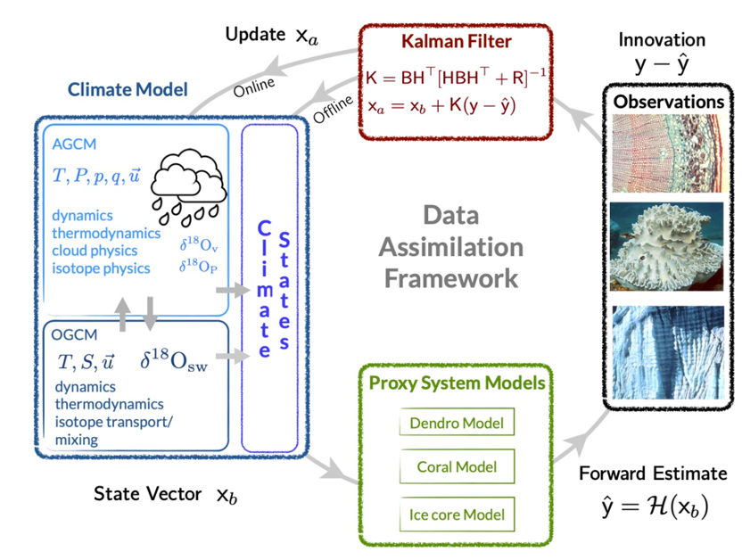
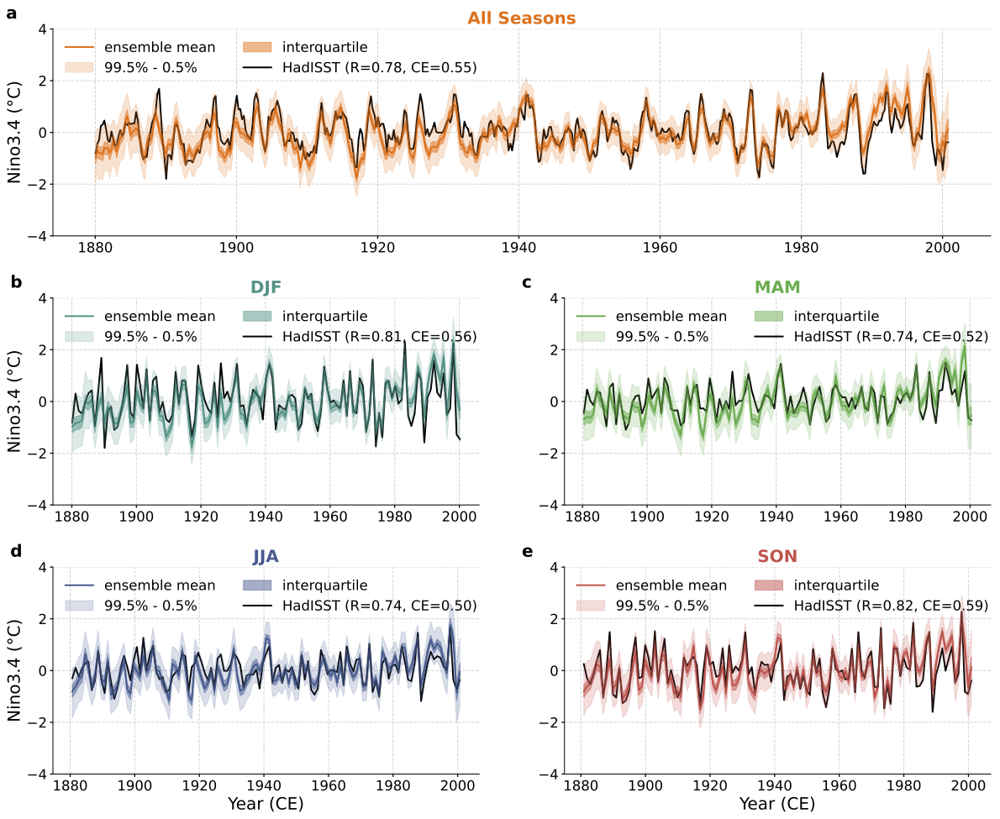

# Code for "Coupled Seasonal Data Assimilation of Sea Ice, Ocean, and Atmospheric Dynamics over the Last Millennium"

Paper: [Arxiv](https://arxiv.org/abs/2501.14130)

## Introduction

Paleo data assimilation is a powerful tool to reconstruct past climate fields. Before the instrumental era, the climate system was not well observed. And the instrumental data is not long enough and strongly forced by human activities. This makes it difficult to study the earth climate variability. However, there are many paleoclimate proxies that can represent the past climate variability, like tree rings, ice cores, and corals. By combining these proxies with climate models, we can reconstruct the past climate fields, like temperature, precipitation, and wind fields and study the past climate variability like ENSO, PDO and AMO. 

This rep is the code for the first seasonal reanalysis dataset over the last millennium using "cycling" data assimilation. The reanalysis dataset will provide a gridded climate field for the last millennium, which can be used to study the past climate variability and the climate change. For example, the lower figure shows the Nino3.4 Index (a measure of El Niño and Southern Oscillation) from the our reanalysis comparing with the HadISST dataset. The reanalysis dataset can provide a accurate ENSO variability for the last millennium. In this case, we can study the ENSO variability in the past and compare it with the present. Additionally, the reanalysis dataset can also be used to study the climate change in the past and compare it with the present.
 

## Authors

[Zilu Meng](https://github.com/ZiluM/LMR_Seasonal); Gregory J. Hakim; Eric J. Steig

## Abstract

"Online" data assimilation (DA) is used to generate a new seasonal-resolution reanalysis dataset over the last millennium by combining forecasts from an ocean--atmosphere--sea-ice coupled linear inverse model with climate proxy records. Instrumental verification reveals that this reconstruction achieves the highest correlation skill, while using fewer proxies, in surface temperature reconstructions compared to other paleo-DA products, particularly during boreal winter when proxy data are scarce. Reconstructed ocean and sea-ice variables also have high correlation with instrumental and satellite datasets. Verification against independent proxy records shows that reconstruction skill is robust throughout the last millennium. Analysis of the results reveals that the method effectively captures the seasonal evolution and amplitude of El Niño events. Reconstructed seasonal temperature variations are consistent with trends in orbital forcing over the last millennium.

## Significance Statement 

This paper introduces the first seasonal-resolution reanalysis of the last millennium, based on an "online" data assimilation method using a linear inverse model to assimilate paleoclimate proxies. We find good agreement when verifying the reconstruction against modern instrumental reanalyses and out-of-sample proxies. Results show that seasonal temperature trends are similar to predictions from orbital-insolation trends, and seasonal variability of modern El Niño events is similar to instrumental reanalyses.

